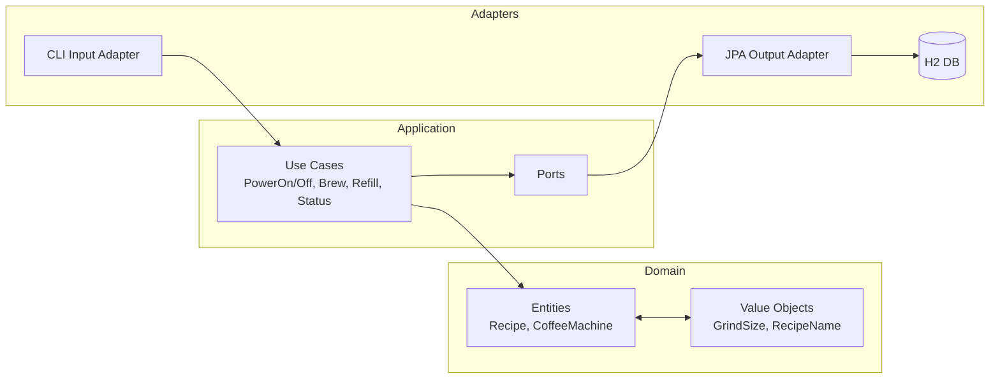
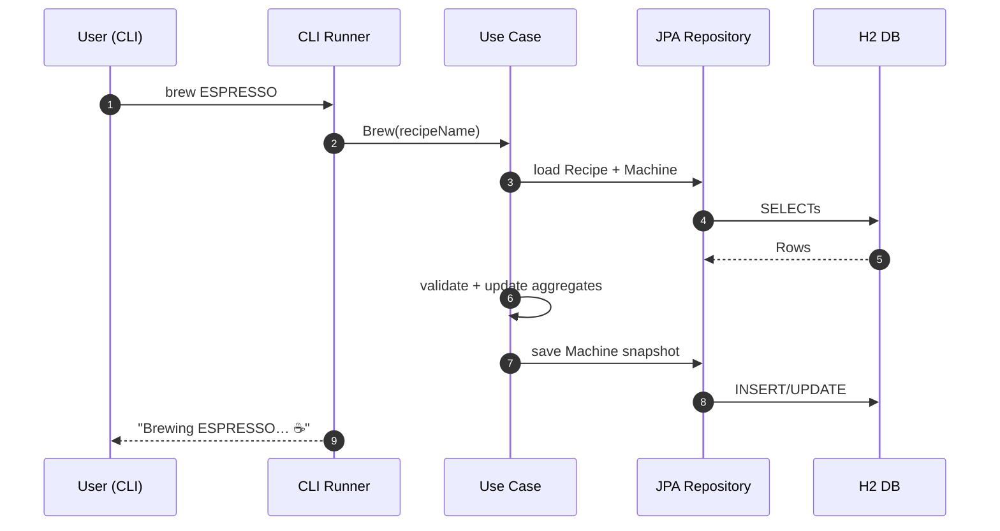

# Coffee Machine Simulator ☕

A Kotlin + Spring Boot hexagonal-architecture playground that simulates an espresso machine. It ships with a CLI, an in-memory H2 database, and Flyway migrations for schema + seed data.

---

## Why this exists

- Practice clean hexagonal architecture (Domain ↔ Application ↔ Adapters).
- Experiment with Spring Boot 3 + Kotlin + JPA on H2.
- Provide a tiny, ergonomic CLI for brewing drinks and tinkering with machine state.

---

## Tech stack

- **Language**: Kotlin 2.x (JDK 21)
- **Framework**: Spring Boot 3.5.x
- **Build**: Gradle (Kotlin DSL)
- **DB**: H2 (in-memory) + **Flyway** migrations
- **ORM**: Spring Data JPA / Hibernate
- **Logging**: Logback
- **Architecture**: Hexagonal (Ports & Adapters)

---

## Modules

```text
coffee-machine-simulator/
├─ coffee-machine-domain/         # Entities, value objects, domain logic
├─ coffee-machine-application/    # Use cases (ports), orchestration
└─ coffee-machine-adapters/       # Adapters: CLI (input), H2/JPA (output), boot app
```

### Hexagonal view



---

## Running

The CLI profile disables web bits and prints clean, minimal logs.

```bash
# Run the CLI
./gradlew :coffee-machine-adapters:bootRun --args='--spring.profiles.active=cli'
# or
SPRING_PROFILES_ACTIVE=cli ./gradlew :coffee-machine-adapters:bootRun
```

You should see:

```bash
INFO  Coffee Machine CLI ☕️
INFO  Commands:
  help                          - show this help
  quit                          - exit
  power on|off                  - turn machine on/off
  status                        - show machine status
  recipes                       - list available recipes
  brew <RECIPE_NAME>            - brew a recipe (e.g., ESPRESSO)
  refill water [ml]             - refill water tank (full if ml omitted)
  refill beans [g]              - refill bean hopper (full if g omitted)
  refill waste                  - empty waste bin
INFO  > 
```

Examples

```bash
> power on
> status
> recipes
> brew ESPRESSO
> refill water 250
> refill beans 100
> refill waste
> power off
> quit
```

## H2 Console

H2 console is available.

- URL: http://localhost:8080/h2-console
- JDBC URL: jdbc:h2:mem:coffee-db
- Username: sa
- Password: (empty)

## Request lifecycle (CLI → DB)



Contributing

PRs are welcome!
Please keep the CLI experience delightful and the architecture tidies.

- Format with Spotless
- Write tests where it adds value
- Keep migrations backward-compatible
