# Coffee Machine Application Module

This module is responsible for orchestrating the domain logic to fulfill the application's use cases. It acts as a bridge between the input adapters (e.g., the CLI) and the core domain model.

## Application Layer Overview

The application layer is composed of a set of use cases, each of which represents a single, atomic operation that can be performed by the user. These use cases are implemented as simple classes that depend on output ports (repositories) to interact with the domain model and external systems.

### Use Cases

*   **`BrewCoffee`**: Brews a coffee recipe. It loads the `CoffeeMachine` and `Recipe` aggregates, invokes the `brew` method on the `CoffeeMachine`, and saves the updated machine state.
*   **`ManageMachine`**: Turns the coffee machine on or off.
*   **`RefillMachine`**: Refills the water tank, bean hopper, or empties the waste bin.
*   **`GetMachineStatus`**: Retrieves the current status of the coffee machine.
*   **`BrowseRecipes`**: Retrieves a list of all available coffee recipes.

## Request Lifecycle Sequence Diagram

The following diagram illustrates the sequence of events for a typical `brew` command, from the user's input to the final state change in the database.

```mermaid
sequenceDiagram
    autonumber
    participant User
    participant InputAdapter as CLI Adapter
    participant UseCase as BrewCoffee
    participant CoffeeMachineRepo as CoffeeMachineRepository
    participant RecipeRepo as RecipeRepository
    participant Domain as CoffeeMachine Aggregate
    participant DB as Database

    User->>InputAdapter: brew ESPRESSO
    InputAdapter->>UseCase: execute("ESPRESSO")
    UseCase->>CoffeeMachineRepo: find()
    CoffeeMachineRepo->>DB: SELECT * FROM coffee_machine
    DB-->>CoffeeMachineRepo: CoffeeMachineEntity
    CoffeeMachineRepo-->>UseCase: CoffeeMachine
    UseCase->>RecipeRepo: findByName("ESPRESSO")
    RecipeRepo->>DB: SELECT * FROM recipe
    DB-->>RecipeRepo: RecipeEntity
    RecipeRepo-->>UseCase: Recipe
    UseCase->>Domain: brew(recipe)
    Domain-->>UseCase: Outcome(updatedMachine, events)
    UseCase->>CoffeeMachineRepo: save(updatedMachine)
    CoffeeMachineRepo->>DB: UPDATE coffee_machine
    InputAdapter-->>User: "Brewing ESPRESSO... ☕"
```

