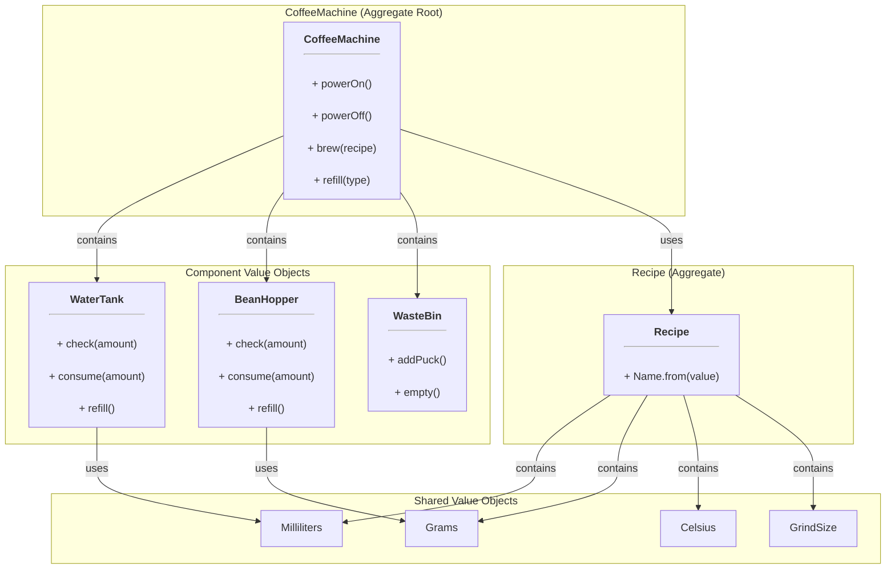

# Coffee Machine Domain Module

This module contains the core business logic, entities, and value objects for the Coffee Machine Simulator. It is the heart of the application and is completely independent of any specific technology or framework.

## Domain Model Overview

The domain is centered around two primary aggregates: `CoffeeMachine` and `Recipe`. The model is designed to be immutable; all operations return a new copy of the object with the updated state.

### `CoffeeMachine` (Aggregate Root)
This is the main aggregate root. It represents the state of a physical coffee machine, including its components and resources. It enforces the business rules related to the machine's operation.

**Main Functions:**
- `powerOn()`: Turns the machine on.
- `powerOff()`: Turns the machine off.
- `brew(recipe: Recipe)`: Brews a coffee recipe, checking resource constraints and producing domain events.
- `refill(type: RefillType)`: Refills the water tank, bean hopper, or empties the waste bin.

### `Recipe` (Aggregate)
This aggregate represents a recipe for a coffee drink. It contains all the necessary information to brew a specific type of coffee.

**Main Functions:**
- `Name.from(value: String)`: A static factory method to look up a recipe `Name` from a string input.

### Component Value Objects

These value objects are part of the `CoffeeMachine` aggregate and represent its physical components.

*   **`WaterTank` (Value Object)**: Represents the machine's water tank.
    *   **Main Functions:**
        *   `check(amount: Milliliters)`: Verifies if there is enough water.
        *   `consume(amount: Milliliters)`: Returns a new `WaterTank` with the water level reduced.
        *   `refill()`: Returns a new `WaterTank` with the water level at full capacity.

*   **`BeanHopper` (Value Object)**: Represents the machine's bean hopper.
    *   **Main Functions:**
        *   `check(amount: Grams)`: Verifies if there are enough beans.
        *   `consume(amount: Grams)`: Returns a new `BeanHopper` with the bean level reduced.
        *   `refill()`: Returns a new `BeanHopper` with the bean level at full capacity.

*   **`WasteBin` (Value Object)**: Represents the machine's waste bin.
    *   **Main Functions:**
        *   `addPuck()`: Returns a new `WasteBin` with an increased puck count.
        *   `empty()`: Returns a new `WasteBin` with the puck count reset to zero.

### `DomainEvent` (Domain Event)
A sealed interface that represents the events that can occur within the domain, such as `BrewingRequested` or `ResourcesConsumed`. These events are generated by the `CoffeeMachine` aggregate during its operations.

## Domain Model Diagram

The following diagram illustrates the relationships between the key components of the domain model.

## Business Rules and Invariants

*   A `CoffeeMachine` must be powered on to brew a recipe.
*   A `CoffeeMachine` must have sufficient water and beans to brew a recipe.
*   The `WaterTank`, `BeanHopper`, and `WasteBin` cannot exceed their maximum capacities.
*   The `brew` method on the `CoffeeMachine` aggregate produces a list of `DomainEvent`s that describe the state changes that occurred during the brewing process.